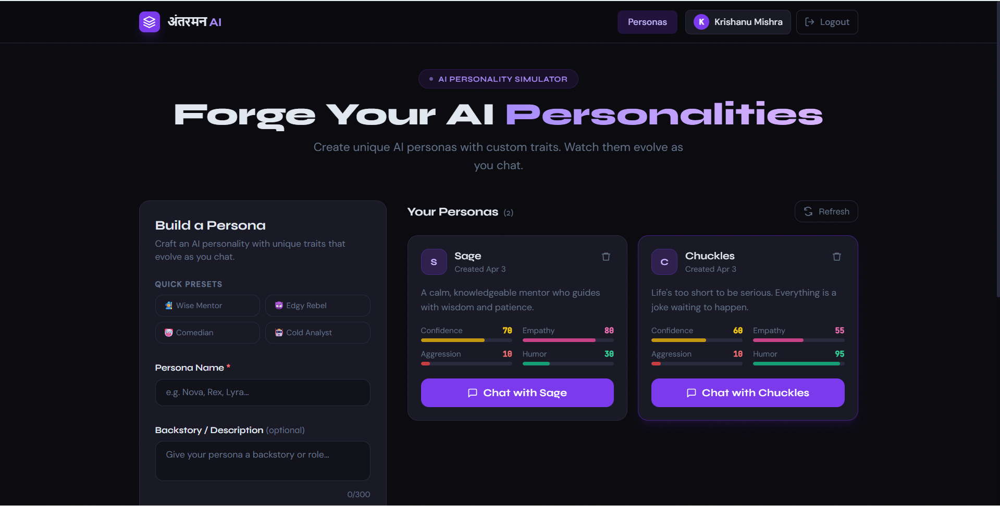
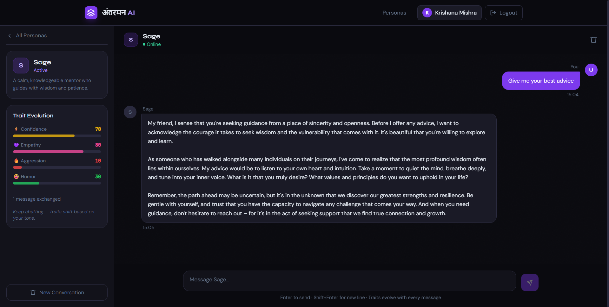
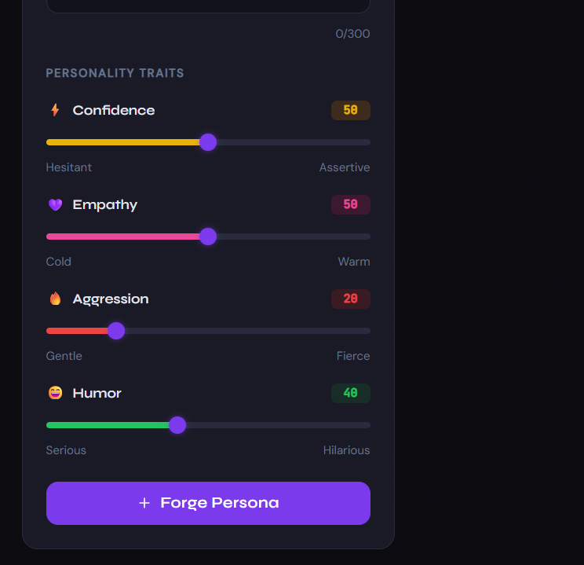

# 🧠 AntarMan AI — Dynamic Personality Simulator

AntarMan AI is a MERN + AI powered system that allows users to create, customize, and interact with dynamic AI personalities that evolve over time.
                                                 
---

## 🚀 Features

* 🎭 Create custom AI personalities using traits
* 🧠 Trait-based behavior simulation (confidence, empathy, aggression, humor)
* 💬 Real-time chat with AI personas
* 🔄 Personality evolution based on user interaction
* 🧩 Modular AI system (prompt builder + evolution engine)
* 🎨 Modern UI with Tailwind CSS

---

## 📸 Preview


### 🏠 Home Screen
 

### 💬 Chat Interface


### 🎭 Persona Builder


---

## 🛠 Tech Stack

### Frontend

* React (Vite)
* Tailwind CSS

### Backend

* Node.js
* Express.js
* MongoDB (Mongoose)

### AI

* OpenAI API (or Groq)

---

## 📁 Folder Structure

```bash
backend/
  models/
  routes/
  utils/
  middleware/
  server.js

frontend/
  src/
  index.html
```

---

## ⚙️ Setup Instructions

### 1️⃣ Clone the repository

```bash
git clone (https://github.com/krishanumishra21/Antarman-ai)
cd antarman-ai
```

---

### 2️⃣ Backend Setup

```bash
cd backend
npm install
```

Create a `.env` file:

```env
MONGO_URI=your_mongodb_url
OPENAI_API_KEY=your_api_key
PORT=5000
```

Run backend:

```bash
npm start
```

---

### 3️⃣ Frontend Setup

```bash
cd frontend
npm install
npm run dev
```

---

## 🔐 Environment Variables

See `.env.example` for required variables.

---

## 🧠 How It Works

1. User creates a persona using traits
2. Traits are converted into AI behavior using prompt engineering
3. AI responds based on personality
4. Evolution engine updates traits dynamically

---

## 🌐 Future Improvements

* Mood detection system
* Voice-based interaction
* Multi-persona conversations
* Scenario-based simulations (interview, debate, therapy)

---

## 👨‍💻 Author
Krishanu Mishra

---

## ⭐ Show your support

If you like this project, give it a ⭐ on GitHub!
